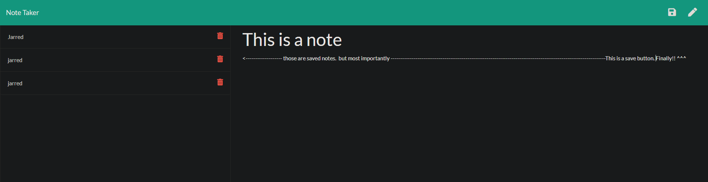

# note_taker
note taking application using Express

  ## Description
  Create a note taker that can write and save notes

  * [Installation](#installation)
  * [Technology](#technology)
  * [Success](#success)
  * [Holdbacks](#holdbacks)
  * [Contribution](#contribution)
  * [Test](#test)
  * [License](#license)
  * [Questions](#questions)
  

## Installation
node.js to set up port 

## Technology
Express.js for backend and notes will be saved/retrieved from a JSON file

## Success
This was a great little project. it didnt have a huge amount of code needed so once I got the code running, i would play around with tweaks to reduce the amount of code I needed. It was great because alot of the code used previous activities syntax so I could really focus on the more intricate parts. 
There are a few class mates i study with online. This was a great one to bounce ideas of eachother and look at the different ways we can make it work. I had other ideas but im not 100% confident in my coding skills so went for what i believed was a simple yet effective process 

## Holdbacks
With alot of my projects, I can get about 80-90% there and hit a wall. Code wise, my first hurdle was issues with the writefile. But discussing with class mates in slack and seeking the help of my TA, it was an easy enough situation to overcome. 
The majority of my woes came from not being able to have the save button generate when the notes were written. this caused me to keep trying new things with my code to no avail. 
With my code checked by my TA and advised it should work, frustration and confusion set in....... Turns out for some reason, i had made a change to my html loading page. Very embarassing mistake and added alot of hours to a simple task but i learnt a very valuable lesson!

## Contribution
We were given a great deal of starting codefor this project. The creation of the server.js file and its contents were the requirements of this task to allow the application to work as desired. I used quite alot of code from the inclass activities, making changes where needed to suit the project.

## Test
no testing 

## License 

## Questions
If you have fursther questions, you can reach me at
[Github](https://github.com/Jarred-Caris)
or
jarred.caris@gmail.com

[click for heroku domain] (https://note-taker-jarred.herokuapp.com/)

[click for URL] (https://jarred-caris.github.io/note_taker/)